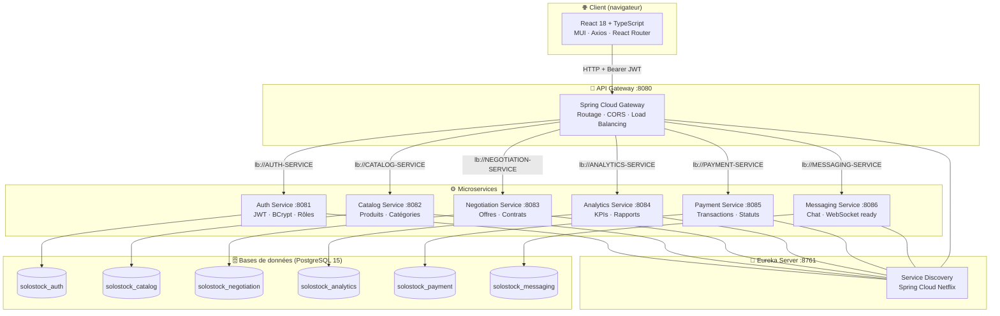
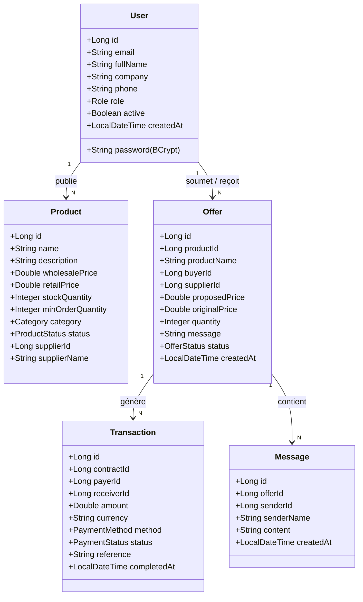

<div align="center">

# 🛒 Solostock B2B

**La plateforme de commerce interentreprises qui connecte fournisseurs et acheteurs marocains**

Solostock B2B est une application web full-stack permettant aux fournisseurs de lister leurs produits et aux acheteurs de négocier des offres en temps réel, suivre leurs paiements et gérer leurs contrats — le tout dans un environnement sécurisé et conteneurisé.

[](#)
[](#)
[](#)
[](#)
[](#)
[](#)
[](#licence)

</div>

---

## 🎬 Démo

<div align="center">

<a href="https://www.youtube.com/watch?v=L8BhLHBoUCQ">
  
</a>

> **Comptes de démonstration** — tous avec le mot de passe `password123`

| Rôle | Email | Accès |
|------|-------|-------|
| 🔴 Admin | `admin@solostock.ma` | Tableau de bord global, gestion des utilisateurs |
| 🔵 Fournisseur | `supplier1@solostock.ma` | Gestion des produits, réception d'offres |
| 🟢 Acheteur | `buyer1@solostock.ma` | Catalogue, envoi d'offres, paiements |

</div>

---

## 📋 Description du Projet

Le commerce B2B marocain repose encore largement sur des échanges informels (appels téléphoniques, e-mails non structurés, négociations opaques). **Solostock B2B** digitalise ce processus en proposant une place de marché sécurisée où :

- Les **fournisseurs** publient leur catalogue de produits wholesale
- Les **acheteurs** parcourent le catalogue et soumettent des offres de prix négociées
- Les deux parties **discutent en direct** dans un chat intégré par offre
- Les **contrats et paiements** sont tracés et archivés automatiquement
- Les **administrateurs** supervisent l'ensemble via un tableau de bord analytique

### ✨ Fonctionnalités principales

- **Catalogue produits** — Gestion complète (CRUD) avec catégories, prix wholesale/retail, stock et statut
- **Système de négociation** — Cycle d'offres complet : `PENDING → ACCEPTED / REJECTED / COUNTER_OFFERED`
- **Chat temps réel** — Messagerie par offre avec polling HTTP (prêt pour migration WebSocket)
- **Gestion des paiements** — Suivi des transactions avec méthodes (virement, crédit, traite, cash) et statuts
- **Analytique & reporting** — Dashboard KPI avec revenus, offres et produits en temps réel
- **Authentification JWT** — Inscription / connexion avec tokens sans état, rôles granulaires
- **Contrôle d'accès par rôle** — Interface et API adaptées selon le rôle (ADMIN / FOURNISSEUR / ACHETEUR)
- **Données de démonstration** — Seeder automatique au démarrage pour une démo clé en main
- **Déploiement Docker** — Tous les services et bases de données orchestrés via Docker Compose

---

## 🏗️ Architecture du Projet

```text
Solostock-project/
│
├── pom.xml                      # POM parent Maven (multi-module)
├── docker-compose.yml           # Orchestration de tous les conteneurs
│
├── eureka-server/               # Registre de services (Spring Cloud Netflix Eureka)
├── api-gateway/                 # Point d'entrée unique, routage & CORS (Spring Cloud Gateway)
│
├── auth-service/                # Authentification, JWT, gestion des utilisateurs (port 8081)
│   └── src/main/java/.../
│       ├── config/              # SecurityConfig, DataSeeder (peuplement initial)
│       ├── controller/          # AuthController (login, register, users)
│       ├── entity/              # User, Role (FOURNISSEUR, ACHETEUR, ADMIN)
│       ├── security/            # JwtService (génération & validation des tokens)
│       └── service/             # AuthService (logique métier)
│
├── catalog-service/             # Catalogue produits B2B (port 8082)
│   └── src/main/java/.../
│       ├── controller/          # ProductController (CRUD produits)
│       ├── entity/              # Product, Category, ProductStatus
│       └── service/             # ProductService + DataSeeder
│
├── negotiation-service/         # Cycle de vie des offres (port 8083)
│   └── src/main/java/.../
│       ├── controller/          # NegotiationController (offres, contrats)
│       ├── entity/              # Offer, Contract, OfferStatus
│       └── service/             # NegotiationService + DataSeeder
│
├── analytics-service/           # KPIs et statistiques (port 8084)
├── payment-service/             # Transactions et paiements (port 8085)
│   └── src/main/java/.../
│       ├── entity/              # Transaction, PaymentMethod, PaymentStatus
│       └── DataSeeder.java      # Transactions de démo pré-insérées
│
├── messaging-service/           # Chat par offre (port 8086)
│   └── src/main/java/.../
│       ├── config/              # WebSocketConfig, SecurityConfig
│       └── controller/          # MessageController (REST polling)
│
└── frontend/                    # Application React / TypeScript (port 3000)
    └── src/
        ├── components/          # Composants réutilisables (ChatDrawer, PageHeader, ConfirmDialog…)
        ├── context/             # AuthContext (état global de l'utilisateur)
        ├── pages/               # Vues principales (Dashboard, Catalog, MyProducts, Payments…)
        ├── services/            # Clients API Axios (catalogService, messagingService…)
        └── theme.ts             # Design system Solostock (couleurs, typographie)
```

---

## 🔧 Architecture Logicielle



---

## 🗄️ Architecture de la Base de Données



> **Note :** Chaque microservice possède sa propre base de données PostgreSQL isolée (pattern *Database per Service*). Les relations inter-services sont maintenues par référence d'identifiant (pas de clés étrangères croisées).

---

## 🔄 Flux de Négociation B2B

| Phase | Étapes | Description |
|-------|--------|-------------|
| **1. Découverte** | Catalogue → Fiche produit | L'acheteur parcourt le catalogue et consulte les détails (prix, stock, fournisseur) |
| **2. Offre initiale** | Formulaire d'offre → `POST /api/negotiation/offers` | L'acheteur propose un prix et une quantité, statut → `PENDING` |
| **3. Négociation** | Chat en temps réel → contre-offre | Les deux parties échangent via le chat lié à l'offre ; le fournisseur peut `COUNTER_OFFERED` |
| **4. Décision** | Accept / Reject | Le fournisseur accepte (`ACCEPTED`) ou rejette (`REJECTED`) ; si accepté, un contrat est généré |
| **5. Paiement** | `POST /api/payment/transactions` | L'acheteur initie le paiement (virement, crédit, traite) ; statut → `COMPLETED` après confirmation |
| **6. Archivage** | Dashboard analytics | La transaction est comptabilisée dans les KPIs du tableau de bord administrateur |

---

## 📦 Prérequis

| Composant | Version minimale | Utilisation |
|-----------|-----------------|-------------|
| **Java (JDK)** | 21+ | Compilation et exécution des microservices Spring Boot |
| **Maven** | 3.9+ | Build multi-module du projet backend |
| **Node.js** | 18+ | Build du frontend React |
| **Docker Desktop** | 24+ | Orchestration de tous les conteneurs |
| **Docker Compose** | v2+ | Définition des services (`docker compose up`) |
| **Git** | 2.x | Clonage du dépôt |

---

## 🚀 Installation & Déploiement

### 1. Cloner le dépôt

```bash
git clone https://github.com/votre-username/Solostock-project.git
cd Solostock-project
```

### 2. Compiler tous les microservices

> Cette étape génère les fichiers `.jar` que Docker copie dans chaque image.

```bash
mvn clean package -DskipTests
```

### 3. Lancer avec Docker Compose

```bash
docker compose up --build -d
```

Docker Compose va :
1. Créer **6 bases de données PostgreSQL** isolées
2. Démarrer l'**Eureka Server** (registre de services)
3. Démarrer l'**API Gateway** (point d'entrée unique)
4. Démarrer les **6 microservices** Spring Boot
5. Démarrer le **frontend React**
6. Exécuter les **seeders automatiques** (données de démonstration insérées au premier démarrage)

### 4. Accéder à l'application

| Service | URL | Description |
|---------|-----|-------------|
| **Application Web** | http://localhost:3000 | Interface utilisateur principale |
| **API Gateway** | http://localhost:8080 | Point d'entrée de toutes les APIs |
| **Eureka Dashboard** | http://localhost:8761 | Registre des services enregistrés |
| **Auth Service** | http://localhost:8081 | API d'authentification |
| **Catalog Service** | http://localhost:8082 | API catalogue produits |
| **Negotiation Service** | http://localhost:8083 | API offres & contrats |
| **Analytics Service** | http://localhost:8084 | API KPIs & statistiques |
| **Payment Service** | http://localhost:8085 | API paiements |
| **Messaging Service** | http://localhost:8086 | API chat & messagerie |

### 5. Arrêter les conteneurs

```bash
# Arrêter sans supprimer les données
docker compose stop

# Arrêter ET supprimer les données (réinitialise la BDD)
docker compose down
```

---

## 🐳 Déploiement Docker — Extrait

```yaml
# docker-compose.yml (extrait)
services:
  eureka-server:
    build: ./eureka-server
    ports: ["8761:8761"]

  api-gateway:
    build: ./api-gateway
    ports: ["8080:8080"]
    environment:
      - EUREKA_CLIENT_SERVICEURL_DEFAULTZONE=http://eureka-server:8761/eureka/

  auth-service:
    build: ./auth-service
    ports: ["8081:8081"]
    environment:
      - SPRING_DATASOURCE_URL=jdbc:postgresql://postgres-auth:5432/solostock_auth
      - EUREKA_CLIENT_SERVICEURL_DEFAULTZONE=http://eureka-server:8761/eureka/
    depends_on: [postgres-auth, eureka-server]

  frontend:
    build: ./frontend
    ports: ["3000:3000"]
    volumes:
      - ./frontend/src:/app/src   # Hot-reload activé
    environment:
      - REACT_APP_API_URL=http://localhost:8080
```

> **Pattern important :** Chaque microservice possède sa propre base PostgreSQL dédiée (`postgres-auth`, `postgres-catalog`, etc.) pour garantir l'isolation totale des données conformément au pattern *Database per Service*.

---

## 🔐 Sécurité

| Mesure | Implémentation |
|--------|---------------|
| **Hashage des mots de passe** | BCrypt via Spring Security — les mots de passe ne sont jamais stockés en clair |
| **Authentification sans état (JWT)** | Tokens HS256 signés, transmis dans l'en-tête `Authorization: Bearer <token>` |
| **Autorisation par rôle** | Trois rôles distincts : `ADMIN`, `FOURNISSEUR`, `ACHETEUR` — routes protégées selon le rôle |
| **Protection CORS** | Configurée au niveau de l'API Gateway et de chaque microservice (`allowedOriginPatterns: *` en dev) |
| **Sessions stateless** | `SessionCreationPolicy.STATELESS` — aucun cookie de session serveur |
| **Isolation des services** | Chaque microservice n'accepte que les requêtes provenant du réseau Docker interne ou du Gateway |
| **Pas de secrets dans le code** | Les mots de passe BDD et clés JWT sont injectés via variables d'environnement Docker |

---

## 🧪 Tests

```bash
# Lancer tous les tests unitaires et d'intégration
mvn test

# Lancer les tests d'un service spécifique
mvn test -pl auth-service
mvn test -pl catalog-service
mvn test -pl negotiation-service

# Vérifier la santé des services via l'API
curl http://localhost:8081/actuator/health  # Auth
curl http://localhost:8082/actuator/health  # Catalog
```

---

## 🛠️ Stack Technique

### Backend
- **Java 21** — Langage principal, syntaxe moderne (records, pattern matching)
- **Spring Boot 3.2** — Framework applicatif, auto-configuration, démarrage rapide
- **Spring Cloud Gateway** — Passerelle API unifiée, routage dynamique par prédicat
- **Spring Cloud Netflix Eureka** — Registre et découverte de services
- **Spring Security + JWT** — Authentification stateless, autorisation par rôle
- **Spring Data JPA + Hibernate** — ORM, migrations automatiques (`ddl-auto: update`)
- **Spring WebSocket (STOMP)** — Infrastructure de chat temps réel (prête pour upgrade)
- **Lombok** — Réduction du code boilerplate (builders, getters, loggers)

### Frontend
- **React 18** — Bibliothèque UI réactive, hooks modernes
- **TypeScript 5** — Typage statique, sécurité à la compilation
- **Material UI (MUI) v5** — Composants accessibles et personnalisables
- **React Router v6** — Navigation SPA côté client
- **Axios** — Client HTTP avec intercepteurs, gestion des tokens JWT
- **Plus Jakarta Sans / DM Sans** — Typographies Google Fonts premium

### Infrastructure & Base de données
- **PostgreSQL 15** — SGBD relationnel robuste, une instance par service
- **Docker & Docker Compose v2** — Conteneurisation et orchestration complète
- **Maven 3 (multi-module)** — Build unifié de tous les microservices depuis la racine
- **Eureka Server** — Registre de services pour la découverte dynamique

---

## 📂 Données de Démonstration

Au premier démarrage, chaque service insère automatiquement des données réalistes :

| Service | Données insérées |
|---------|-----------------|
| **Auth** | 1 admin, 3 fournisseurs, 3 acheteurs (7 utilisateurs) |
| **Catalog** | 15 produits B2B réalistes sur 6 catégories |
| **Negotiation** | 12 offres avec statuts variés (PENDING, ACCEPTED, REJECTED, COUNTER_OFFERED) |
| **Payment** | 6 transactions (4 complétées, 1 en attente, 1 échouée) |

> Les seeders sont **idempotents** — ils vérifient si la table est vide avant d'insérer. Relancer les conteneurs sans `docker compose down` ne duplique pas les données.

---

## 📄 Licence

```
MIT License

Copyright (c) 2026 Solostock B2B

Permission is hereby granted, free of charge, to any person obtaining a copy
of this software and associated documentation files (the "Software"), to deal
in the Software without restriction, including without limitation the rights
to use, copy, modify, merge, publish, distribute, sublicense, and/or sell
copies of the Software, and to permit persons to whom the Software is
furnished to do so, subject to the following conditions:

The above copyright notice and this permission notice shall be included in all
copies or substantial portions of the Software.

THE SOFTWARE IS PROVIDED "AS IS", WITHOUT WARRANTY OF ANY KIND, EXPRESS OR
IMPLIED, INCLUDING BUT NOT LIMITED TO THE WARRANTIES OF MERCHANTABILITY,
FITNESS FOR A PARTICULAR PURPOSE AND NONINFRINGEMENT.
```

---

<div align="center">

Conçu avec ❤️ pour digitaliser le commerce B2B marocain

**[⬆ Retour en haut](#-solostock-b2b)**

</div>
